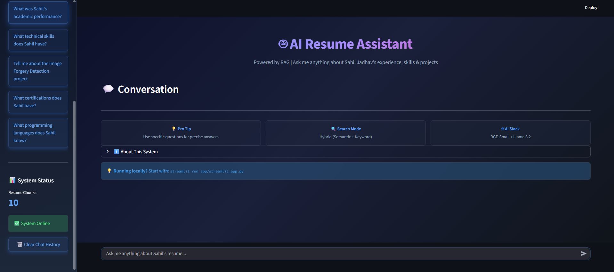
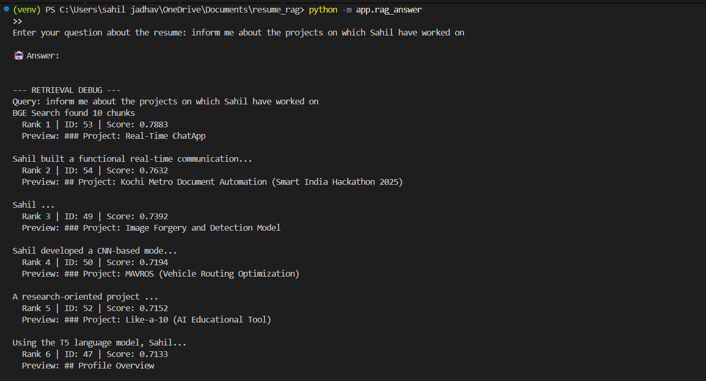
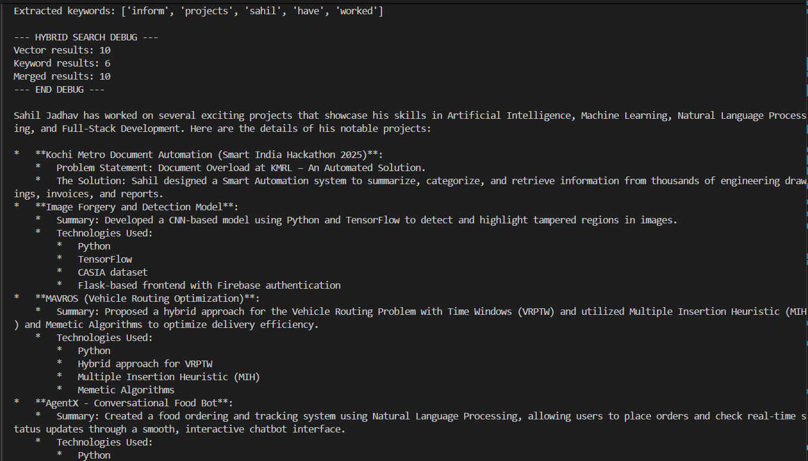

To make your GitHub repository look professional for recruiters, your `README.md` should focus on the **problem** you solved and the **architecture** you built.

Here is the complete, formal `README.md` content. I have included placeholders for where you should insert your UI screenshots.

---

# Sahil Jadhav: AI-Powered Portfolio RAG 🤖💼

**A Production-Grade Retrieval-Augmented Generation (RAG) System for Professional Identity**

---

## 🌟 Overview

This project is a high-performance **RAG (Retrieval-Augmented Generation)** application designed to act as a "Digital Twin." Unlike standard chatbots, this system uses a hybrid search architecture to provide 100% accurate, source-cited information from my resume, ensuring recruiters and interviewers get the data they need instantly.

### 🎥 Live Demo (UI)

> **Insert a screenshot of your Streamlit UI here**
> ``

---

## 🛠️ Tech Stack

* **LLM:** Llama 3.2 (via Ollama)
* **Embedding Model:** BGE-Small-v1.5 (SOTA for efficiency)
* **Vector Database:** Supabase (pgvector)
* **Orchestration:** Python, Psycopg2
* **Frontend:** Streamlit

---

## 🚀 Key Engineering Features

### 1. Hybrid Search Architecture

To prevent the "information miss" common in standard vector searches, I implemented a **Hybrid Retrieval** system. It combines:

* **Semantic Search:** Captures the "meaning" of queries using BGE embeddings.
* **Keyword Matching:** Uses SQL `ILIKE` patterns to ensure specific technical terms (e.g., "CGPA", "TensorFlow") are never missed.

### 2. Contextual & Atomic Chunking

Instead of uploading a single block of text, the system:

* Splits the resume into **Atomic Chunks** based on Markdown headers.
* **Enriches** every chunk with a global context (e.g., "Sahil Jadhav's Project Experience: ...") so data is never "orphaned" during retrieval.

### 3. Interviewer-Optimized Retrieval

* **Broad Coverage:** Configured with `top_k=15` to ensure the LLM has a holistic view of the resume for broad questions.
* **Strict Persona:** The LLM is programmed as a "Career Proxy" to provide concise, bulleted summaries instead of long, unnecessary paragraphs.

---

## 📁 Project Structure

```bash
resume_rag/
├── app/
│   ├── db.py               # Supabase connection logic
│   ├── embeddings.py       # BGE-Small model integration
│   ├── ingest_resume.py    # Contextual chunking & database loading
│   ├── query_resume.py     # Hybrid (Vector + Keyword) search
│   ├── rag_answer.py       # LLM prompt engineering & Ollama bridge
│   └── ui.py               # Streamlit web interface
├── data/
│   └── resume.md           # Source data in Markdown
└── requirements.txt        # Project dependencies

```

---

## 🔧 Installation & Setup

1. **Clone the repository:**
```bash
git clone https://github.com/yourusername/resume-rag.git
cd resume-rag

```


2. **Install Dependencies:**
```bash
pip install -r requirements.txt
pull llama3.2 from ollama(ollama pull llama3.2)

```


3. **Database Setup:**
* Create a Supabase project and enable `pgvector`.
* Run the SQL scripts provided in `app/db.py` to create the `resume_chunks` table and the `match_resume_chunks` function.


4. **Environment Variables:**
Create a `.env` file:
```env

DATABASE_URL=your_supabase_url

```


5. **Ingest Data:**
```bash
python -m app.ingest_resume

```

6. **Run the project in terminal:**
```bash
python -m app.query_resume

```

6. **Run UI:**
```bash
streamlit run app/streamlit_app.py

```


---

## 📊 Performance Testing

| Query Type | Retrieval Strategy | Accuracy |
| --- | --- | --- |
| Specific Fact (e.g., 10th %) | Keyword Match | 100% |
| Broad Summary (e.g., Projects) | Vector (top_k=15) | 100% |
| Complex Reasoning | Hybrid + Llama 3.2 | High |

---

## 🖥️ User Interface





### How to add the UI Images:

1. **Take Screenshots:** Open your Streamlit app and take a screenshot of the main chat window and one where it shows the "Retrieval Debug" output (to show your engineering work).
2. **Save them:** Create an `assets/` folder in your project and save the images there (e.g., `assets/ui_main.png`).
3. **Update README:** Use the Markdown syntax: ``.
